# LAB3 WEB

<table border="2" cellpading="10">
  <tr>
    <td><b>Nama</b></td>
    <td>Ilham Nur Utomo</td>
  </tr>
  <tr>
    <td><b>NIM</b></td>
    <td>312010129</td>
  </tr>
  <tr>
    <td><b>Kelas</b></td>
    <td>TI.20.A1</td>
  </tr>
  <tr>
    <td><b>MataKuliah</b></td>
    <td>Pemrograman Web</td>
  </tr>
</table>

# <b>Praktikum</b>

## <b>1. File HTML </b>
- Membuat file baru, ``lab3_list.html``
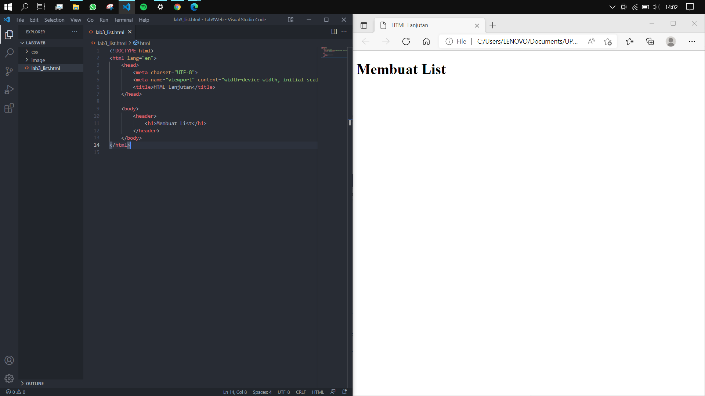

## <b>2. Ordered list </b>
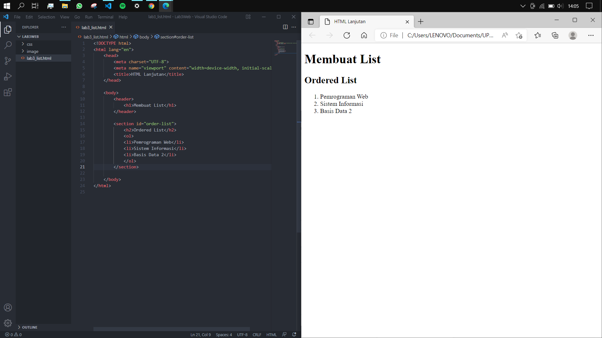

## <b>3. Unordered list </b>
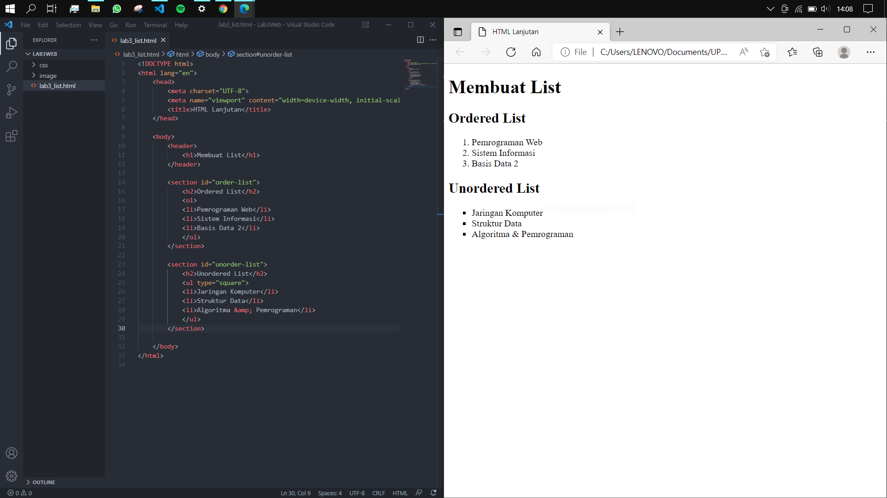

## <b>4. Description list </b>
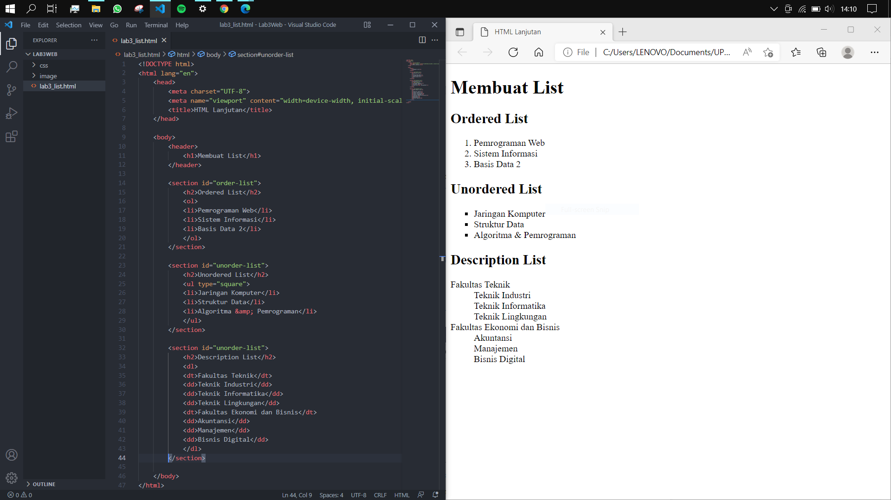

## <b>5. Table HTML </b>
- Dengan membuat file baru, ``lab3_tabel.html``
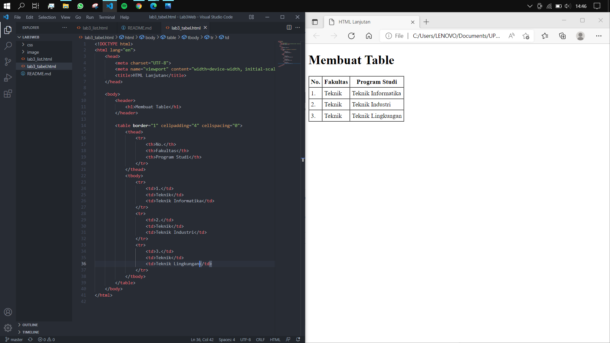

## <b>6. Table border, margin, dan padding </b>
- Mengubah atribut ``border``, ``margin``, dan ``padding``
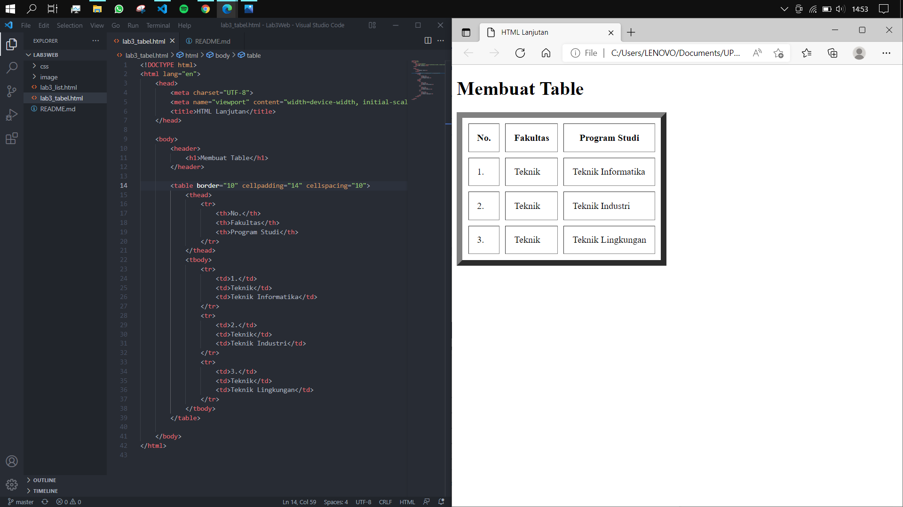

## <b>7. Menggabungkan sel data </b>
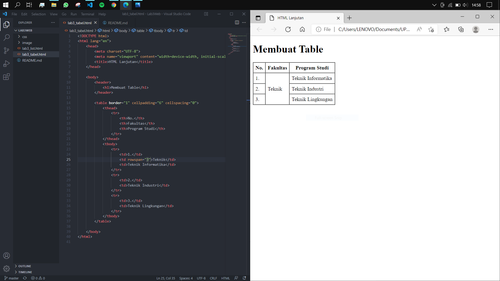

## <b>8. Membuat form </b>
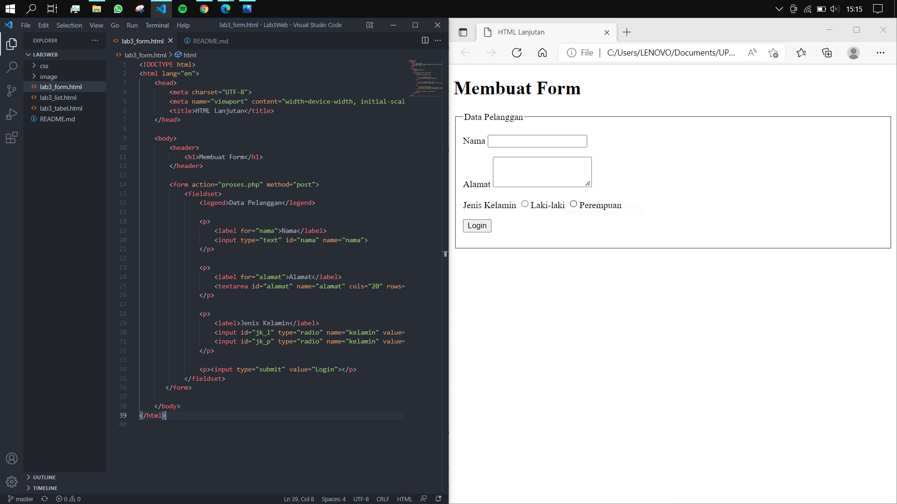

## <b>9. Style pada form </b>
- Dengan internal css
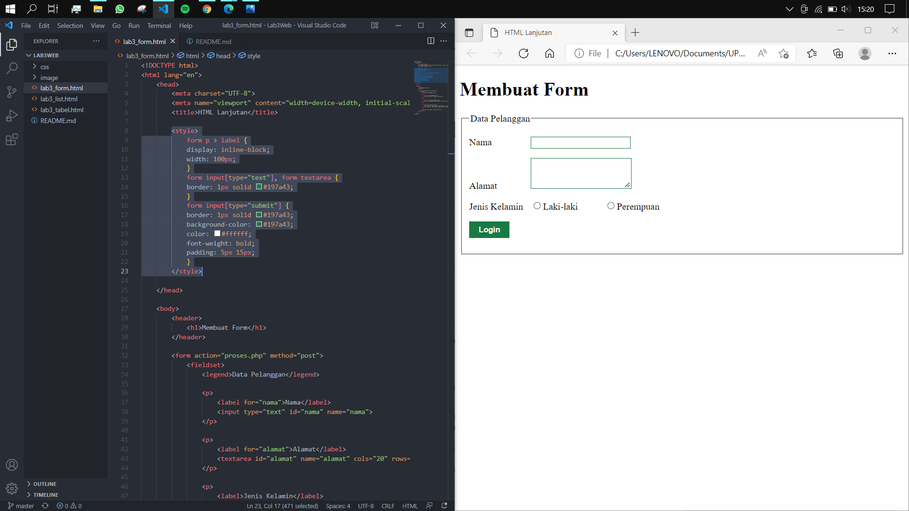

# Latihan
<b>1. Buatlah form yang menampilkan dropdown menu dan listbox dengan multiple selection.</b>

- Jawaban= 

- Kode HTML
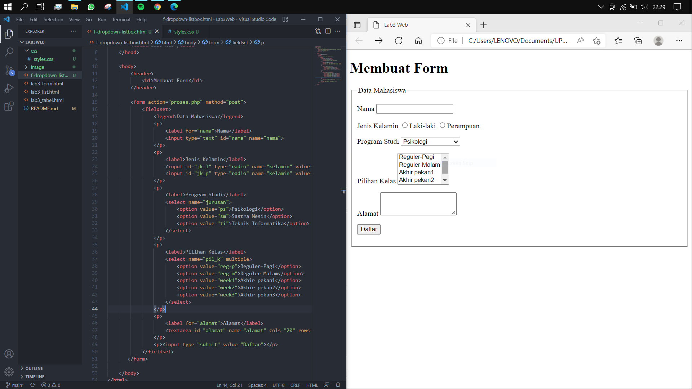 

- Kode CSS (eksternal)
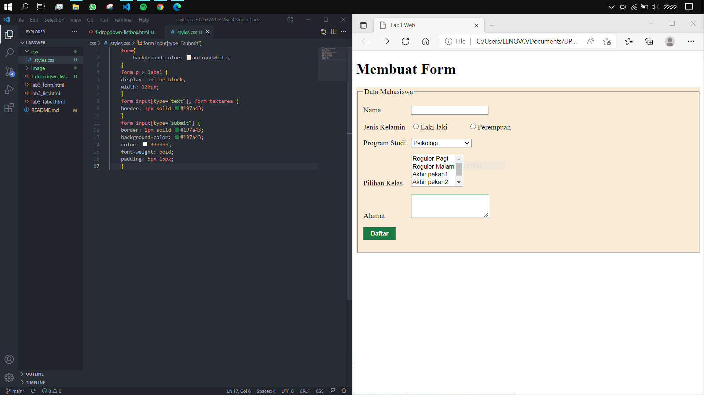 

- Dropdown Menu
 

- Listbox Multiple Selection
 

- Dengan ``multiple``, membantu memilih lebih dari 1 pilihan.